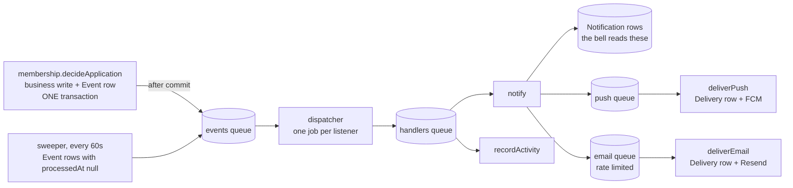

# Domain events, queue and worker

The pipeline that turns "something happened" into inbox rows, push and email. The decisions
behind it live in [ARCHITECTURE.md](ARCHITECTURE.md) (*The Worker*, *Notification bell*,
*Chat*); the Firebase credential is documented next to `FIREBASE_SERVICE_ACCOUNT` in
`.env.example` and read only by `src/lib/push.ts`. This file is how it works and how to add
to it.

The promise: an event is **defined once, emitted once**, and any number of listeners run
from it, asynchronously and with retries. Adding a listener never touches the code that
emitted the event.

## The path of one event



Nothing in the request path waits for any of that. `decideApplication` returns as soon as
its transaction commits.

## Adding an event

1. **Define it** in `src/lib/events/catalog.ts`. Ids and facts only, never a message.
   `scopeOf` in `store.ts` copies `actorUserId` and `chapterId` onto the row when the
   event carries them. The two `countryAdmin.*` events have no chapter at all, so they
   store **`chapterId: null`** — the country and the appointee live in the payload. The
   history line they produce is global for the same reason, visible only to a reader whose
   scope is global.
2. **Emit it** from the facade that owns the write, inside `transaction`:

   ```ts
   return transaction(async (tx, emit) => {
     const ride = await insertRide(tx, data);
     await emit({ type: "ride.requested", rideId: ride.id, chapterId: ride.chapterId });
     return ride;
   });
   ```

   Every service on that path needs a `db: Prisma.TransactionClient = prisma` parameter.
   Emit **once**: guard the emit on the write having actually changed something, the way
   `joinAsPassenger` stays silent when the member already had the role.
3. **Decide who listens** in `src/worker/handlers.ts`. This file will not compile until you
   do — the registry is exhaustive over `EventType`. That is the feature, not a nuisance.
4. **If `notify` is one of them**, add a kind in `src/use-cases/notifications/kinds/` and
   list it in that folder's `index.ts`. A kind is the whole notification in one file: the
   event, category, delivery policy, recipients, the payload schema and how to fill it,
   the href, and `message`, which turns the payload, the recipient's strings and their
   locale into a subject, heading, body, note and call to action. The inbox row, the push
   banner and the mail all render from that one message.
5. **Copy** goes into `src/messages/email/{en,da,de}.json`. When the message sets a
   `template`, that id must exist under `admin.history.templates` in
   `src/messages/app/{en,da,de}.json` too — the activity feed falls back to "approval" for an
   id it does not know. `src/use-cases/notifications/kinds/messages.test.ts` pins the set.
6. **If it should show in the member history**, add a builder to
   `src/worker/listeners/record-activity.ts` and list `recordActivity` next to `notify` in
   `handlers.ts`. The listener throws for an event without a builder, so the two always
   agree.

`notify`, `deliverEmail` and `deliverPush` are generic and never change for a new kind. A
new *category* is only a new value in the Zod enum in
`src/features/notifications/schemas.ts`; the column is a string, so there is no migration.
A new category does need an icon in the bell's map
(`src/components/notifications/notification-bell-menu.tsx`), which is typed over the enum
and will not compile without one.

## What a kind decides

```ts
type DeliveryPolicy = {
  push: boolean;
  email: "always" | "ifNoPush" | "never";
  optional: boolean;
};
```

- The **inbox row is always created**, whatever the policy says. Push and email are
  deliveries derived from it.
- `optional: true` hands the decision to the recipient's `notifyPush` / `notifyEmail`.
  Essential kinds (an invite, a decision on an application) ignore both.
- `notify` enqueues a `push` job immediately when `policy.push`, an `email` job
  immediately when `email === "always"`, and an `email` job **delayed by
  `EMAIL_FALLBACK_DELAY_MS` (2 min)** when `email === "ifNoPush"`. The jobId is
  `${notificationId}-${channel}`, so a re-dispatch of the same event enqueues nothing new.
- Every preference and reachability check runs **at delivery time**, in the delivery use
  case, so every outcome is a `Delivery` row rather than a silence: `"opted out"`,
  `"no email address"`, `"no device"`, `"push not configured"`,
  `"email disabled for kind"`, `"disabled by chapter"`.
- The fallback rule lives in `deliverEmail`. When the delayed `ifNoPush` job wakes up it
  skips with `"already read"` if the notification has a `readAt`, and with
  `"push delivered"` if the sibling `push` delivery is `sent`. Otherwise the mail goes out.
- `collapseKey?(event)` is optional and lands on the `Notification` row. It is the handle
  for "five ride requests become one card" later; no kind sets it today.
- `chapterAllowsPush?(chapterId)` is optional too: the **chapter's** say on the push
  channel, read in `deliverPush` right after the recipient's own preference, so a chapter
  that switched the alert off still leaves a `Delivery` row — `"disabled by chapter"` —
  instead of a silence. A kind without the hook has no chapter switch.
  `pilotApplication.submitted` answers it from
  `chapters.getSettings(chapterId).applicationAlertPush`; an event with `chapterId: null`
  always passes, because there is no chapter to ask.
- A kind may instead consult `chapters.getSettings` in **`recipients`** and suppress itself
  entirely: `chapter.memberJoined` returns `[]` when the chapter turned
  `notifyOnMemberJoined` off, so no inbox row is written at all. Use that when the chapter
  is switching off *the notification*, and `chapterAllowsPush` when it is switching off
  *one channel* and the bell should still fill.
- `deliverEmail` looks up `replyToEmail` for the event's chapter and sets the mail's
  `Reply-To` when the chapter named one, so a reply reaches the chapter rather than the
  platform sender. An event with no chapter keeps the platform sender.
- All three read `features/chapters`' `ChapterSettings` row through the facade, which
  answers with the defaults while the chapter has no row. See
  [ARCHITECTURE.md](ARCHITECTURE.md) → *Chapter settings*.
- `Message` is email-shaped. `heading` and `body` carry the mail; `title` is the shorter
  line the bell and the push banner use when a kind sets it (the welcome card reads
  "Welcome to München" while the mail keeps its heading). `steps` renders the numbered
  "how it works" card in `NotificationEmail` and a numbered list in the plain-text part.

## The queues

`src/lib/events/queues.ts` defines four:

| Queue      | Consumer                              | Why it is its own queue                                        |
| ---------- | ------------------------------------- | -------------------------------------------------------------- |
| `events`   | dispatcher + the 60 s sweeper         | one job per event, fans out to listeners                        |
| `handlers` | `runListener`, concurrency 10         | one job per (event, listener)                                   |
| `email`    | `runEmailDelivery`, rate limited      | Resend allows 10 requests/s per team                            |
| `push`     | `runPushDelivery`, concurrency 5      | FCM has no such limit, and mail must never hold a push back     |

The email worker runs with `limiter: { max: RESEND_RATE_LIMIT, duration: 1000 }` and the
same number as its concurrency, where `RESEND_RATE_LIMIT` defaults to **8** — the two
requests left over are the sign-in OTPs the Next.js app sends directly, outside this
pipeline. When Resend answers `429` anyway, `sendMail` throws `MailRateLimitedError` with
the wait Resend named; `runEmailDelivery` parks the whole email worker with
`queue.rateLimit(ms)` and throws `Worker.RateLimitError()`, which returns the job to
waiting without spending one of its five attempts. `deliverEmail` lets that error through
untouched, so a throttle never shows up as a failed delivery.

## Maintenance jobs

The `events` queue also carries the jobs nobody emitted. `worker/index` routes them through
a `MAINTENANCE` map keyed by job name and falls back to the dispatcher, so a maintenance job
can never be mistaken for an event id:

| Scheduler       | When                    | What it does                                                                   |
| --------------- | ----------------------- | ------------------------------------------------------------------------------ |
| `sweep`         | every 60 s              | re-queues `Event` rows Redis never heard about                                  |
| `prune-devices` | `0 4 * * *` (04:00 UTC) | deletes `Device` rows whose `lastSeenAt` is older than `STALE_DEVICE_DAYS` (270) |
| `prune-chat`    | `0 3 * * *` (03:00 UTC) | deletes `chat_message` rows older than 12 months in 1,000-row batches, then conversations with no members left |

`notifications.registerDevice` bumps `lastSeenAt` on every app open, so the cutoff means
"no sign of this install for nine months", not "no push has been sent to it". 270 days is
FCM's own expiry for an inactive token, so the prune only removes rows FCM would reject
anyway — a volunteer who does not open the app over the winter keeps their push. That is one
half of token hygiene; the other half is FCM answering a send with *not registered*, which
`deliverPush` turns into `notifications.removeDeviceTokens` on the spot. Both schedulers are
registered with `upsertJobScheduler`, so restarting the worker does not stack them up.

## Chat: one event, no bell row (COD-245)

`chat.messageSent { conversationId, messageId, seq, actorUserId, chapterId }` is the one event
in the catalog whose entry in `handlers.ts` is a single listener, `{ chatNotify }`. No `notify`,
so **no `Notification` row and no bell card**; no `recordActivity`, so no history line. A message
is either live in front of you, a banner, or a line in tomorrow's mail — it is never something
waiting in an inbox. Unread is arithmetic (`lastSeq > lastReadSeq` per membership), which is why
nothing needs to be counted.

Everything below the bell is reused as-is. `notify-chat-message` loads the members through the
chat facade, drops the sender, and for each remaining recipient — in chunks of 25 — skips anyone
muted or currently focused on that conversation (`presence.isFocusedOn`), then:

| Queue   | `job.name`     | Data                                                 | Id |
| ------- | -------------- | ---------------------------------------------------- | -- |
| `push`  | `chat`         | `{ recipientUserId, conversationId, messageId }`      | jobId `chat-<messageId>-<recipientUserId>` |
| `email` | `chat-digest`  | `{ recipientUserId, conversationId, windowStartedAt }` | deduplication id `chat-digest-<recipientUserId>-<conversationId>` |

`worker/index.ts` routes both delivery queues by `job.name`, so `chat` and `chat-digest` sit
beside the generic `runPushDelivery` / `runEmailDelivery` without touching them. The digest goes
through the same `parkOnRateLimit` wrapper as every other mail, so a Resend `429` parks the
worker rather than failing the job.

**The digest debounce.** Email is only for a recipient push cannot reach — no device, or push
switched off. Those recipients get one grouped mail per conversation, not one per message. The
job is enqueued with BullMQ's trailing-edge deduplication (`{ id, extend: true, replace: true }`)
and a delay from `digest-window.ts`: **5 minutes after the last message, capped at 15 minutes
after the first unread one**. A plain `jobId` would not reset the delay, which is why the
deduplication form is load-bearing. The producer reads the live job through
`queue.getDeduplicationJobId` + `Job.fromId` and carries its `windowStartedAt` forward, so the
15-minute cap survives every replacement.

Both deliveries re-decide at wake-up rather than trusting what was true at enqueue time:
`deliver-chat-push` re-checks read position, mute and `notifyChatPush` before sending and
collapses a conversation's banners into one (`collapseKey`, which becomes FCM's
`android.collapseKey` + `notification.tag` and APNs' `apns-collapse-id` + `thread-id`);
`deliver-chat-digest` re-checks membership, unread, mute, `notifyChatEmail` and *still no push*,
then decrypts only the recipient's own unread rows and renders `src/emails/chat-digest.tsx`.
Neither writes a `Delivery` row — chat has no inbox row to hang one off. Instead
`deliver-chat-digest` returns what happened (`sent`, `already read`, `muted`, `push available`,
…), which Bull Board shows as the job's return value, so a quiet mailbox can be explained
from the `email` queue's *completed* tab.

## Watching the queues

The worker serves [Bull Board](https://github.com/felixmosh/bull-board) at
**<http://localhost:3001/queues>** (`WORKER_PORT`). It lists every job per queue and per
state — waiting, active, completed, failed, delayed — with its payload, attempt count,
error and stack, and it can retry or promote a job by hand. A delayed `ifNoPush` mail sits
in the `email` queue's *delayed* tab for its two minutes; promoting it there is the fastest
way to test the fallback.

The same server answers **`GET /health`**: `200 {"ok":true}` while every BullMQ worker
is running and Redis answers a queue count within two seconds, otherwise `503` with a `reason`.
The compose files probe it every 30 s, so `docker compose ps` shows the worker as
`unhealthy` when it hangs. Docker does not restart an unhealthy container by itself;
`restart: unless-stopped` only covers a process that exits.
