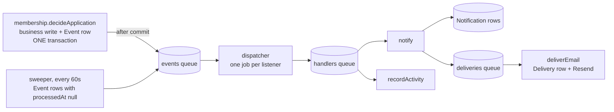

# Domain events, queue and worker

The pipeline that turns "something happened" into inbox rows and email. Design and the
options behind it: [NOTIFICATIONS-PLAN.md](NOTIFICATIONS-PLAN.md). This file is how it
works and how to add to it.

The promise: an event is **defined once, emitted once**, and any number of listeners run
from it, asynchronously and with retries. Adding a listener never touches the code that
emitted the event.

## The path of one event



Nothing in the request path waits for any of that. `decideApplication` returns as soon as
its transaction commits.

## Adding an event

1. **Define it** in `src/lib/events/catalog.ts`. Ids and facts only, never a message.
2. **Emit it** from the facade that owns the write, inside `transaction`:

   ```ts
   return transaction(async (tx, emit) => {
     const ride = await insertRide(tx, data);
     await emit({ type: "ride.requested", rideId: ride.id, chapterId: ride.chapterId });
     return ride;
   });
   ```

   Every service on that path needs a `db: Prisma.TransactionClient = prisma` parameter.
3. **Decide who listens** in `src/worker/handlers.ts`. This file will not compile until you
   do — the registry is exhaustive over `EventType`. That is the feature, not a nuisance.
4. **If `notify` is one of them**, add a kind in `src/use-cases/notifications/kinds/` and
   list it in that folder's `index.ts`. A kind is the whole notification in one file: the
   event, category, channels, recipients, the payload schema and how to fill it, the href,
   and `message`, which turns the payload and the recipient's strings into heading, body,
   note and call to action. Email, and later push and the inbox, render from that one
   message.
5. **Copy** goes into `src/emails/strings/{en,da,de}.ts`.

`notify` and `deliverEmail` are generic and never change for a new kind. A new *category*
is only a new value in the Zod enum in `src/features/notifications/schemas.ts`; the column
is a string, so there is no migration.

## Watching the queues

The worker serves [Bull Board](https://github.com/felixmosh/bull-board) at
**<http://localhost:3001/queues>** (`WORKER_PORT`). It lists every job per queue and per
state — waiting, active, completed, failed, delayed — with its payload, attempt count,
error and stack, and it can retry or promote a job by hand.

The same server answers **`GET /health`**: `200 {"ok":true}` while every BullMQ worker
is running and Redis answers a queue count within two seconds, otherwise `503` with a `reason`.
The compose files probe it every 30 s, so `docker compose ps` shows the worker as
`unhealthy` when it hangs. Docker does not restart an unhealthy container by itself;
`restart: unless-stopped` only covers a process that exits.
