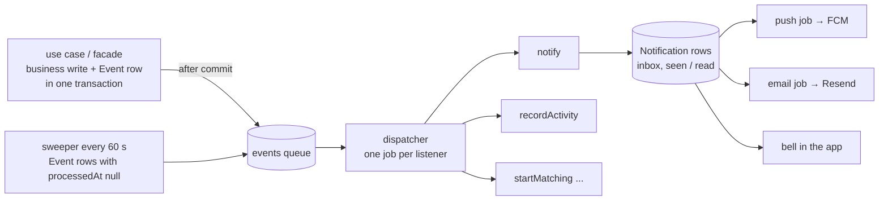

# Notifications and domain events

Plan for the pipeline that turns "something happened" into inbox cards, push and email,
and later feeds chat and any other listener. Written for team discussion on 2026-09-05.
Nothing in here is implemented yet.

The core promise: an event is defined once, emitted once, and any number of listeners run
from it, asynchronously and durably. `ride.requested` notifies chapter admins today and
starts pilot matching tomorrow without touching the code that emitted it.

## What we need

| Requirement                                                                                          | Source          |
| ---------------------------------------------------------------------------------------------------- | --------------- |
| Emit an event once, distribute to any number of listeners                                            | product         |
| The sender never waits for delivery                                                                  | product         |
| Channels: in-app inbox with bell and read state, push via FCM on iOS and Android, email via Resend   | product         |
| Email is a fallback when push cannot reach the user; approvals get push **and** email                | product         |
| No SMS beyond login PINs, no web push, no digest emails                                              | product         |
| Bell need not be live in v1; chat must be live and reuse this pipeline for its push and email fallback | product         |
| Ride reminders at chapter-configurable lead times: hardcoded defaults plus one settings row per chapter | RFP 05, product |
| Notifications to all roles on a ride; escalation ladders for unstaffed rides                         | RFP 05, 07      |
| User-to-user and group messaging                                                                     | NFR 27          |
| Rendered in the recipient's language and culture                                                     | NFR 7, 8        |
| A few thousand Danish users first, then global, possibly a US region                                 | product         |

## What exists today

- Prod is one Docker container running Next.js standalone against MySQL 8. No Redis, no
  worker. `lib/rate-limit.ts` is in-memory and already assumes a single instance.
- `lib/mailer.ts` sends through Resend with react-email templates in `src/emails`, strings
  per locale, Mailpit in dev.
- `@capacitor/push-notifications` is installed. `lib/native/push.ts` only requests
  permission. No device token storage, no sender.
- `User` already has `locale`, `notifyEmail`, `notifyPush`.
- `lib/activity` records `ActivityEvent` rows from facades and use cases. It is already a
  domain-event log with a single consumer, the member activity feed.

## Decisions taken

1. Build in-house. No notification SaaS.
2. Events are persisted in MySQL in the same transaction as the business change
   (transactional outbox).
3. Queue: BullMQ on Redis. Recommended below and open to challenge, see Options.
4. Workers run as a separate process in a separate container, same Docker image. Never
   inside the Next.js server.
5. Push via FCM for both platforms using `firebase-admin`. Email via Resend.
6. One region is one self-contained cell: app, worker, Redis, MySQL. A US rollout is a
   second cell, not a redesign.

## The pattern

Every mature notification system, whether Slack, LinkedIn, or the products that package the
pattern (Knock, Courier, Novu), separates the same six stages.



1. **Emit a domain event, not a message.** Business code says `ride.requested`, never
   "send email". Ids and facts only.
2. **Persist atomically.** The `Event` row is written inside the caller's transaction.
   Nothing is lost if Redis or the worker is down; the sender returns immediately.
3. **Fan out in a worker.** Each listener runs as its own job with retries. A slow or
   failing listener never delays another.
4. **The inbox is the source of truth.** Push and email are deliveries derived from the
   `Notification` row, never the other way round.
5. **Deliver per channel with retries and idempotency.** A unique key per notification and
   channel prevents duplicates on retry.
6. **Record everything.** Event, notification, delivery attempt and provider response are
   rows. Support answers "why did I not get that email" from the database.

Two rules that matter for our spec:

- **Check state at run time, not at schedule time.** A reminder job reloads the ride when
  it fires and does nothing if the ride was cancelled or moved. Chapter lead-time changes
  then need no cancellation logic.
- **Escalation is a delayed job that re-checks.** Chat: deliver live if the recipient is
  connected; push after 30 s if unread; email after 10 min if still unread and no push
  could be delivered. This is Slack's decision tree.

## Options

### Queue and orchestration

| Option                                             | Model                                            | Durable                | Delayed jobs                      | Fan-out                                   | Needs                                                            | MySQL ok | Verdict                                                                                                                                 |
| -------------------------------------------------- | ------------------------------------------------ | ---------------------- | --------------------------------- | ----------------------------------------- | ---------------------------------------------------------------- | -------- | --------------------------------------------------------------------------------------------------------------------------------------- |
| **BullMQ on Redis**                                | job queue + worker library                       | yes, Redis with AOF    | yes, plus repeatable              | one job per listener                      | Redis                                                            | yes      | **Recommended.** Mature, MIT, dashboards, rate limits, dedup by job id. Redis also serves cross-instance rate limiting and chat pub/sub |
| MySQL as queue (`FOR UPDATE SKIP LOCKED`)          | polling worker, hand-rolled                      | yes                    | `runAt` column                    | same                                      | nothing new                                                      | yes      | Fallback if we refuse Redis. No mature Node library for MySQL; we own ~150 lines and lose dashboard, rate limits, pub/sub               |
| DBOS Transact TS                                   | durable workflows, in-process library            | yes, every step        | `DBOS.sleep`, `delaySeconds`, cron | one workflow per listener via a queue     | **Postgres** system database                                     | **no**   | Strong if we ever move to Postgres. Detailed below                                                                                     |
| Inngest                                            | event-triggered functions, steps, sleep, wait    | yes                    | yes                               | declarative, one function per listener    | Inngest server, SaaS or self-hosted                              | yes      | Closest to Nest `@OnEvent`. Revisit if ride workflows grow waits and branches                                                            |
| Trigger.dev                                        | tasks with retries and waits                     | yes                    | yes                               | yes                                       | SaaS, or self-host with Postgres, Redis, ClickHouse              | yes      | Heavier than Inngest for the same gain                                                                                                  |
| Temporal                                           | durable workflows, separate cluster              | yes                    | yes                               | yes                                       | Temporal server plus its datastore, or Temporal Cloud            | yes      | The large-company standard for long multi-service workflows. Overkill for fan-out                                                       |
| Vercel Workflow DevKit                             | `"use workflow"` directives inside Next          | yes                    | yes                               | yes                                       | Vercel, or a Postgres-oriented backend                           | unclear  | Launched late 2025, Vercel-centric. Watch, do not bet                                                                                  |
| Upstash QStash                                     | HTTP queue calling route handlers                | yes                    | yes                               | yes                                       | SaaS                                                             | yes      | The serverless answer. Pointless when we own Redis                                                                                      |
| Kafka, RabbitMQ, NATS, SQS                         | brokers                                          | yes                    | partly                            | yes                                       | a broker cluster                                                 | yes      | Kafka is a log for many consumers at very high volume. Not now                                                                          |
| Node `EventEmitter` on `globalThis` plus `after()` | in-process, what Nest's emitter does             | **no**                 | no                                | yes                                       | nothing                                                          | yes      | Rejected. Lost on redeploy, no retries. This is Nest's gap, not its strength                                                            |
| Quirrel                                            | Next-specific job queue                          |                        |                                   |                                           |                                                                  |          | Abandoned. Framework-specific job libraries do not survive in this ecosystem                                                            |

**Why BullMQ.** Mature, MIT, every Node developer knows it. Delayed and repeatable jobs,
deduplication by job id, rate limiting, priorities, Bull Board. Redis also gives us a
cross-instance rate limiter and pub/sub for chat, which we need anyway. Per-cell deployment
is trivial. Redis runs with `appendonly yes`.

**Why not DB-as-queue.** The right call for an app that stays on one VPS. We are told
global. Polling adds database load and there is no mature MySQL job library for Node.

#### DBOS Transact TS in detail

<https://github.com/dbos-inc/dbos-transact-ts>. MIT, `@dbos-inc/dbos-sdk`, Node 20+.

**What it is.** Durable execution as a library, no orchestration server. Workflows are
ordinary async functions. Each step's result is checkpointed to a Postgres "system
database". If the process dies, the workflow resumes from the last completed step on
restart. Steps run at least once, transactions commit exactly once, workflows always
complete.

**What maps to our needs.**

- Workflow IDs as idempotency keys: same id, runs once.
- Durable queues with `workerConcurrency`, `globalConcurrency`, `rateLimit`,
  `deduplicationID`, `priority`, `delaySeconds`, `timeoutMS`. Multiple processes consume
  the same queue.
- `DBOS.sleep()` survives restarts; `DBOS.registerScheduled()` for cron. Reminders and the
  chat escalation become straight-line code: sleep 30 s, check read, push, sleep 10 min,
  check read, email.
- `DBOS.send/recv` and `setEvent/getEvent` for messaging between workflows.
- `listWorkflows`, `forkWorkflow` for operations. Dashboards and automatic recovery of a
  dead executor's in-flight workflows in a multi-process deployment come from DBOS
  Conductor, an optional out-of-band control plane, hosted or self-hosted. Without it that
  recovery is manual.
- Has a Nest.js integration guide. The closest to the decorator feel the team knows.

**Why it is not the default recommendation.**

- **Postgres only.** Our app database is MySQL. Two paths: (a) run a Postgres solely as
  the DBOS system database next to MySQL. Then DBOS cannot commit our business write and
  its checkpoint in one transaction, the outbox problem stays, and we operate two
  databases. (b) Migrate the app to Postgres. Cheap while the schema is small, and it also
  unlocks pg-boss, graphile-worker and `LISTEN/NOTIFY`. Team decision, see Open questions.
- Cannot be bundled. Must be marked external for Next.js and for the worker bundle.
- Multi-process recovery needs Conductor or manual coordination.

Same flow in DBOS, for shape comparison:

```ts
const notifyOnRideRequested = DBOS.registerWorkflow(
  async (event: EventOf<"ride.requested">) => {
    const recipients = await DBOS.runStep(
      () => membership.adminUserIdsOf(event.chapterId),
      { name: "recipients" },
    );
    for (const userId of recipients) {
      await DBOS.runStep(() => notifications.create(userId, event), {
        name: `inbox:${userId}`,
      });
    }
    await DBOS.sleep(30_000);
    // check read, push, sleep, check read, email ...
  },
);

await DBOS.startWorkflow(notifyOnRideRequested, {
  queueName: "events",
  workflowID: `${eventId}:notify`,
})(event);
```

### Notification platforms: build or buy

| Product        | Gives                                                                                  | Verdict                                                                                                                                      |
| -------------- | -------------------------------------------------------------------------------------- | -------------------------------------------------------------------------------------------------------------------------------------------- |
| Knock, Courier | workflows, preferences, inbox API and components, batching, provider integrations, logs | Recipient rules, tenancy, i18n and preferences are our domain and largely exist. Per-message pricing at global scale. Another GDPR processor. **Build** |
| Novu           | the same, open source, self-hostable                                                   | Needs MongoDB, Redis and several services. Heavier than what it replaces                                                                     |
| MagicBell      | inbox-focused                                                                          | Our brand system needs custom UI anyway                                                                                                      |
| OneSignal      | push-focused, some email                                                               | A vendor between us and FCM for no gain                                                                                                      |

### Channel adapters and real-time

| Layer           | Options                                                                | Pick                                                                                                                  |
| --------------- | ---------------------------------------------------------------------- | --------------------------------------------------------------------------------------------------------------------- |
| Push            | `firebase-admin` direct, OneSignal                                     | `firebase-admin`, `sendEachForMulticast`, delete tokens on `registration-token-not-registered`                         |
| Email           | Resend (have), Postmark, SES                                           | Resend. Add bounce and complaint webhooks; pass an idempotency key per Delivery                                        |
| Chat real-time  | Centrifugo, Socket.IO with Redis adapter, Ably, Pusher, Supabase Realtime | Decide in the chat design. Centrifugo: one binary, JWT auth, presence built in, Redis engine for multi-node           |
| Queue dashboard | Bull Board, Taskforce.sh                                               | Bull Board mounted on the worker, admin-only                                                                          |

## Proposed design

### Tables

| Table                         | Purpose                     | Key columns                                                                                                                                      |
| ----------------------------- | --------------------------- | ------------------------------------------------------------------------------------------------------------------------------------------------ |
| `Event`                       | outbox and audit            | type, payload, actorUserId?, chapterId?, createdAt, processedAt?. Index (processedAt, createdAt)                                                 |
| `Notification`                | the inbox                   | recipientUserId, eventId, category, payload, href, collapseKey?, seenAt?, readAt?, createdAt. Index (recipientUserId, createdAt), (recipientUserId, seenAt) |
| `Delivery`                    | one row per channel attempt | notificationId, channel, status, attempts, providerMessageId?, lastError?, sentAt?. Unique (notificationId, channel)                              |
| `Device`                      | FCM tokens                  | userId, platform, token unique, lastSeenAt                                                                                                       |
| `ChapterNotificationSettings` | one row per chapter         | rideReminderLeadHours, volunteerReminderLeadHours, unstaffedEscalationHours. Defaults live in code                                                 |

`User.locale`, `notifyEmail` and `notifyPush` already exist. Templates render title, body
and href in the recipient's locale from the i18n dictionary at send time **and** at display
time, so the inbox re-renders when a user switches language. `ActivityEvent` becomes one
listener's output.

### Routing policy

| Category                     | Inbox                             | Push                                | Email                                                    |
| ---------------------------- | --------------------------------- | ----------------------------------- | -------------------------------------------------------- |
| approval, invitation         | always                            | if notifyPush and a device exists   | always, if notifyEmail                                   |
| ride reminder, roster change | always                            | if notifyPush and a device exists   | only if no push was delivered                            |
| chat message                 | always, collapsed per conversation | after 30 s, skipped if already read | after 10 min if still unread and no push was delivered   |

Reminders run as a repeatable sweep every minute that queries rides whose window just
opened and emits events. Idempotency is a sent-at stamp on the ride. This beats delayed
jobs because lead-time changes and rescheduling need no cancellation logic.

### Where it lives

| Path                                          | Layer         | Role                                                                                                        |
| --------------------------------------------- | ------------- | ----------------------------------------------------------------------------------------------------------- |
| `src/lib/events/catalog.ts`                   | cross-cutting | Zod discriminated union of all events. The single place an event is defined                                 |
| `src/lib/events/emit.ts`                      | cross-cutting | `transaction(fn)`: runs the Prisma transaction, writes an `Event` row per `emit`, enqueues after commit     |
| `src/lib/redis.ts`                            | cross-cutting | ioredis client, `globalThis` singleton like `lib/prisma.ts`                                                 |
| `src/features/notifications/`                 | feature       | facade and services: create rows, list inbox, mark seen and read, register devices, record deliveries. No rules |
| `src/use-cases/notifications/rules/<event>.ts` | orchestration | one file per event: category, recipients, render. Crosses features, so a use case                           |
| `src/use-cases/notifications/notify.ts`       | orchestration | the generic listener: rule lookup, recipients, `Notification` rows, enqueue deliveries                       |
| `src/worker/handlers.ts`                      | boundary      | the listener map, exhaustive over `EventType`                                                               |
| `src/worker/index.ts`                         | boundary      | BullMQ workers: dispatcher, handler runner, delivery adapters, sweeper                                       |

The worker is a boundary layer like `actions.ts`. It may import use cases and facades,
carries no session, exactly as the CRON rule in `AGENTS.md` anticipates. Services must
accept an optional transaction client so the business write and the `Event` row share one
transaction. That is the one convention change.

### Code sketches

`src/lib/events/catalog.ts`

```ts
import { z } from "zod";

export const eventSchema = z.discriminatedUnion("type", [
  z.object({
    type: z.literal("ride.requested"),
    rideId: z.string(),
    chapterId: z.string(),
    requesterUserId: z.string(),
  }),
  z.object({
    type: z.literal("pilotApplication.decided"),
    applicationId: z.string(),
    chapterId: z.string(),
    userId: z.string(),
    actorUserId: z.string(),
    approved: z.boolean(),
  }),
  z.object({
    type: z.literal("chat.messageSent"),
    messageId: z.string(),
    conversationId: z.string(),
    senderUserId: z.string(),
    recipientUserIds: z.array(z.string()),
  }),
]);

export type Event = z.infer<typeof eventSchema>;
export type EventType = Event["type"];
export type EventOf<K extends EventType> = Extract<Event, { type: K }>;
```

`src/lib/events/emit.ts`

```ts
import { Queue } from "bullmq";
import { prisma } from "@/lib/prisma";
import { redis } from "@/lib/redis";
import type { Event } from "./catalog";

export const eventsQueue = new Queue("events", { connection: redis });

type Tx = Parameters<Parameters<typeof prisma.$transaction>[0]>[0];
type Emit = (event: Event) => Promise<void>;

export async function transaction<T>(
  fn: (tx: Tx, emit: Emit) => Promise<T>,
): Promise<T> {
  const emitted: string[] = [];

  const result = await prisma.$transaction(async (tx) => {
    const emit: Emit = async (event) => {
      const row = await tx.event.create({
        data: { type: event.type, payload: event },
      });
      emitted.push(row.id);
    };
    return fn(tx, emit);
  });

  // fast path only; the sweeper re-enqueues anything Redis missed
  await Promise.allSettled(
    emitted.map((id) => eventsQueue.add("dispatch", { id }, { jobId: id })),
  );
  return result;
}
```

`src/features/rides/facade.ts` (the emit moment)

```ts
import { transaction } from "@/lib/events/emit";
import { requestRideInput, type RequestRideInput } from "./schemas";
import { insertRide } from "./services/rides";

export function request(input: RequestRideInput) {
  const data = requestRideInput.parse(input);
  return transaction(async (tx, emit) => {
    const ride = await insertRide(tx, data);
    await emit({
      type: "ride.requested",
      rideId: ride.id,
      chapterId: ride.chapterId,
      requesterUserId: data.requesterUserId,
    });
    return ride;
  });
}
```

`src/worker/handlers.ts` (the `@OnEvent` equivalent)

```ts
import type { EventOf, EventType } from "@/lib/events/catalog";
import { notify } from "@/use-cases/notifications/notify";
import { recordActivity } from "@/use-cases/record-activity";
import { startMatching } from "@/use-cases/matching/start-matching";

type Handler<K extends EventType> = (event: EventOf<K>) => Promise<void>;
type Registry = { [K in EventType]: Record<string, Handler<K>> };

export const handlers: Registry = {
  "ride.requested": { notify, startMatching },
  "pilotApplication.decided": { notify, recordActivity },
  "chat.messageSent": { notify },
};
```

The type is exhaustive: add an event to the catalog and this file fails to compile until
someone decides who listens. Adding a listener later is one word on one line.

`src/worker/index.ts`

```ts
import { Queue, Worker } from "bullmq";
import { prisma } from "@/lib/prisma";
import { redis } from "@/lib/redis";
import { eventSchema } from "@/lib/events/catalog";
import { eventsQueue } from "@/lib/events/emit";
import { handlers } from "./handlers";

const handlerQueue = new Queue("handlers", { connection: redis });

async function loadEvent(id: string) {
  const row = await prisma.event.findUniqueOrThrow({ where: { id } });
  return eventSchema.parse(row.payload);
}

new Worker(
  "events",
  async (job) => {
    if (job.name === "sweep") {
      const stale = await prisma.event.findMany({
        where: {
          processedAt: null,
          createdAt: { lt: new Date(Date.now() - 60_000) },
        },
        select: { id: true },
      });
      await eventsQueue.addBulk(
        stale.map(({ id }) => ({
          name: "dispatch",
          data: { id },
          opts: { jobId: id },
        })),
      );
      return;
    }

    const event = await loadEvent(job.data.id);
    await handlerQueue.addBulk(
      Object.keys(handlers[event.type]).map((name) => ({
        name,
        data: { eventId: job.data.id },
        opts: {
          jobId: `${job.data.id}:${name}`,
          attempts: 5,
          backoff: { type: "exponential", delay: 2_000 },
        },
      })),
    );
    await prisma.event.update({
      where: { id: job.data.id },
      data: { processedAt: new Date() },
    });
  },
  { connection: redis },
);

new Worker(
  "handlers",
  async (job) => {
    const event = await loadEvent(job.data.eventId);
    const handler = handlers[event.type][job.name] as (
      e: typeof event,
    ) => Promise<void>;
    await handler(event);
  },
  { connection: redis, concurrency: 10 },
);

await eventsQueue.upsertJobScheduler("sweep", { every: 60_000 });
```

`src/use-cases/notifications/rules/ride-requested.ts` ("define the event once" lives here)

```ts
import type { Rule } from "./types";
import * as membership from "@/features/membership/facade";

export const rideRequested: Rule<"ride.requested"> = {
  category: "rideRequest",
  recipients: (e) => membership.adminUserIdsOf(e.chapterId),
  render: (e, t) => ({
    title: t.notifications.rideRequested.title,
    body: t.notifications.rideRequested.body,
    href: `/admin/rides/${e.rideId}`,
  }),
};
```

`notify` is generic: look up the rule for the event type, resolve recipients, create one
`Notification` row each in the recipient's locale, enqueue push and email deliveries per the
routing table. Rules are data, so a notification for a new event is one file like this one.

### Nest.js mapping

| NestJS                                           | Here                                                              |
| ------------------------------------------------ | ----------------------------------------------------------------- |
| `eventEmitter.emit('ride.requested', dto)`       | `emit({ type: "ride.requested", ... })` inside the transaction    |
| `@OnEvent('ride.requested')` on a service method | one entry in the `handlers` map                                   |
| In-process, lost if the pod dies mid-handler     | outbox row plus a retried job per listener, visible in Bull Board |
| One slow or failing listener delays the rest     | listeners are independent jobs                                    |
| Module scanning finds listeners                  | the exhaustive type finds them for you                            |

Next.js itself ships no event bus, DI container or decorator scanning. `after()` is
fire-and-forget in-process, `instrumentation.ts` runs once at boot, route handlers let
external schedulers call in. Everything else is a library.

## Deployment

- Same Docker image, two commands. The builder stage bundles `src/worker/index.ts` with
  esbuild to `worker.js` (Prisma client external, copied as today). The runner keeps
  `server.js` and `worker.js` side by side.
- `docker-compose.prod.yml` gains `redis` (`redis:7-alpine`, `--appendonly yes`, a volume)
  and `worker` (same image, `command: node worker.js`, same env file). `app` is unchanged.
- Dev: `redis` in `docker-compose.yml`; `dev:worker` script runs `tsx src/worker/index.ts`.
- Multi-region later: repeat the cell. No global shared state.

## Security

- Inbox queries filter on the session user id. Mark-read verifies ownership. Device
  registration binds the token to the session user. Tokens never return to the client.
- `href` is stored as a relative path and validated to start with `/`. An absolute URL here
  is an open redirect.
- Bull Board is mounted on the worker only, behind super-admin auth or a private network,
  never on the public app.
- Recipient resolution runs through facades with no session; every rule scopes by chapter.

## Gotchas

- On iOS `@capacitor/push-notifications` returns an APNs token, not an FCM token. Use
  `@capacitor-firebase/messaging` inside `lib/native/push.ts` so both platforms hand us
  FCM tokens.
- FCM has no idempotency key. Set `Delivery.status = sending` before the call; a crash
  mid-call may double-send one push. Accepted, industry standard for push.
- Redis persistence must be on. Without `appendonly yes` a Redis restart drops queued jobs;
  the sweeper would recover events but not in-flight delivery jobs.

## Phases

1. Outbox, Redis, BullMQ, worker container, `Event`, `Notification`, `Delivery` tables,
   the bell with seen and read. Wire the existing approval and membership events;
   `recordActivity` becomes a listener.
2. Device registration, `@capacitor-firebase/messaging`, FCM sender.
3. Email fallback via the existing templates, Resend webhooks.
4. `ChapterNotificationSettings` and the reminder sweep, once rides exist.
5. Chat: live layer plus the escalation policy on top of the same pipeline.

## Open questions for the team

1. Redis or Valkey. Same protocol, different licence.
2. Do we ever want Postgres? Deciding now is cheap and it decides whether DBOS is a real
   option.
3. Spike DBOS on a Postgres branch for a day to compare shapes, or go straight to BullMQ?
4. Chat real-time layer: Centrifugo self-hosted or Ably managed.
5. Per-category notification preferences in v1 or later? The two booleans cover today's
   routing table.
6. Who owns Bull Board access and alerting on failed jobs?
