# Dependency graph

Which Use Cases call which Facades. Update this whenever a feature or use case is added.

The audit log is **infrastructure**, not a feature: it lives in `src/lib/activity` beside
`lib/auth-guards` and `lib/mailer`, so any layer may write a history line. That is why
`change-member-role`, `submit-pilot-applications` and `claim-account` are gone — each
coordinated exactly one feature plus the log, which AGENTS.md says is not a use case. Their
logic sits in the facade that owns the domain rule (`membership.changeMemberRole` carries the
"cannot change your own role" rule; `accounts.claimAccount` the claim), and the Action calls
that facade directly.

`decide-pilot-application` is gone for the same reason. Once the decision emitted
`pilotApplication.decided` instead of calling the activity log and the mailer itself, it
coordinated one facade and nothing else, so it collapsed into `membership.decideApplication`
— which now owns the transaction the `Event` row commits in — and `app/admin/members/actions`
calls that facade directly. Its old work is two listeners in the worker.

> Newly qualifying for the same treatment: `manage-chapter` and `manage-country` now touch
> only `chapters` plus the log, so both could collapse into their Actions or into the
> `chapters` facade. Left as-is deliberately — the facade already exports thin
> `createChapter`/`updateChapter`/`deleteChapter` wrappers, so merging them is a naming
> decision rather than a mechanical move.

```mermaid
graph TD
  subgraph Presentation
    A[src/app]
    ADM[app/admin shell]
    CMD[app/admin/commands]
    BELL[components/notifications bell]
    PR[components/push-registrar]
  end
  subgraph Boundary
    G[lib/auth-guards]
    ACT1[features/membership/actions]
    ACT2["app/(flow)/location/actions"]
    ACT3["app/(flow)/onboarding/actions"]
    ACT4["app/join/[slug]/start/route"]
    ACT5[app/admin/members/actions]
    ACT6[app/admin/chapters/actions]
    ACT7[app/admin/countries/actions]
    ACT8[features/accounts/actions]
    ACT9[features/notifications/actions]
    ACT10[app/admin/settings/actions]
  end
  subgraph Orchestration
    U1[use-cases/build-session-access]
    U2[use-cases/onboarding-progress]
    U3[use-cases/settle-passenger-location]
    U4[use-cases/accept-onboarding-consent]
    U5[use-cases/complete-onboarding-profile]
    U9[use-cases/manage-country-admins]
    U10[use-cases/provision-assisted-passenger]
    U11[use-cases/invite-chapter-user]
    U13[use-cases/manage-chapter]
    U14[use-cases/manage-country]
    U15[use-cases/notifications/notify]
    U16[use-cases/notifications/deliver-email]
    U17[use-cases/notifications/deliver-push]
    U18[use-cases/notifications/inbox]
    U19[use-cases/notifications/kinds]
  end
  subgraph Worker
    W1["worker/index (dispatcher, sweeper, prune-devices, email + push workers)"]
    W2[worker/handlers registry]
    W3["worker/listeners/record-activity (generic)"]
    W4[worker/deliveries]
  end
  subgraph Features
    F1[features/chapters facade]
    F2[features/membership facade]
    F3[features/profile facade]
    F4[features/passengers facade]
    F6[features/accounts facade]
    F7[features/notifications facade]
    CM1[features/chapters/commands]
    CM2[features/membership/commands]
    CM3[features/profile/commands]
    CM4[features/passengers/commands]
  end
  subgraph Data
    S1[chapters/services]
    S2[membership/services]
    S3[profile/services]
    S4[passengers/services]
    S6[accounts/services]
    S7[notifications/services]
    DB[(MySQL via lib/prisma)]
  end
  subgraph Infrastructure
    F5[lib/activity]
    EV[lib/events outbox]
    Q[("Redis via BullMQ")]
    MB[lib/mapbox]
    ML[lib/mailer]
    PUSH[lib/push firebase-admin]
    NP[lib/native/push]
    BA[lib/auth BetterAuth admin API]
    COOKIE[(guest chapter + join preset cookies)]
  end

  A --> G
  A --> F1
  A --> F5
  A --> U2
  G --> F1
  G --> F3
  AUTH[lib/auth customSession] --> U1

  A --> BELL
  ADM --> BELL
  BELL --> G
  BELL --> U18
  BELL --> ACT9
  A --> PR
  PR --> ACT9
  PR --> NP
  ACT9 --> G
  ACT9 --> F7
  ADM --> ACT10
  ACT10 --> G
  ACT10 --> F1

  A --> ADM
  ADM --> G
  ADM --> CMD
  CMD --> CM1
  CMD --> CM2
  CMD --> CM3
  CMD --> CM4

  A --> ACT1
  A --> ACT2
  A --> ACT3
  ACT1 --> F2
  ACT3 --> F6
  ACT2 --> F1
  ACT2 --> U3
  ACT2 --> MB
  ACT2 --> COOKIE
  ACT3 --> F3
  ACT3 --> U2
  ACT3 --> U4
  ACT3 --> U5
  ACT3 --> COOKIE
  ACT4 --> F1
  ACT4 --> COOKIE

  ADM --> ACT5
  ADM --> ACT6
  ADM --> ACT7
  ADM --> ACT8
  ACT8 --> U10
  ACT8 --> U11
  ACT5 --> F2
  ACT5 --> F6
  ACT6 --> F1
  ACT6 --> U13
  ACT6 --> MB
  ACT7 --> F1
  ACT7 --> U9
  ACT7 --> U14

  U1 --> F1
  U1 --> F2
  U2 --> F1
  U2 --> F2
  U2 --> F3
  U3 --> F2
  U3 --> F3
  U4 --> F2
  U4 --> F3
  U5 --> F2
  U5 --> F3
  U5 --> F4
  U9 --> F1
  U9 --> F3
  U10 --> F2
  U10 --> F4
  U10 --> F5
  U10 --> F6
  U11 --> F2
  U11 --> F3
  U11 --> F6
  U13 --> F1
  U13 --> F5
  U14 --> F1
  U14 --> F5
  U15 --> F7
  U15 --> U19
  U15 --> Q
  U16 --> F7
  U16 --> F1
  U16 --> F3
  U16 --> F5
  U16 --> ML
  U16 --> U19
  U17 --> F7
  U17 --> F3
  U17 --> PUSH
  U17 --> U19
  U18 --> F7
  U18 --> U19
  U19 --> F1
  U19 --> F2
  U19 --> F3

  F1 --> EV
  F2 --> EV
  F3 --> EV
  EV --> DB
  EV --> Q
  Q --> W1
  W1 --> EV
  W1 --> F7
  W1 --> W2
  W1 --> W4
  W4 --> U16
  W4 --> U17
  W2 --> U15
  W2 --> W3
  W3 --> F5

  F1 --> S1
  F2 --> S2
  F2 --> F5
  F6 --> F5
  F1 --> F5
  F3 --> S3
  F4 --> S4
  F6 --> S6
  F7 --> S7
  S7 --> DB
  S1 --> DB
  S2 --> DB
  S3 --> DB
  S4 --> DB
  F5 --> DB
  S6 --> DB
  S6 --> BA
```

| Use case | Facades it coordinates | Why it exists |
| --- | --- | --- |
| `build-session-access` | `chapters`, `membership` | The session payload needs the user's country-admin scopes (chapters) *and* their chapter memberships (membership). Two facades → a use case. |
| `onboarding-progress` | `chapters`, `membership`, `profile` | How far someone got is spread across three tables: which chapter they joined, what they consented to, whether a rider profile exists. Read by the `/onboarding` resolver and by every step that draws the progress dots. |
| `settle-passenger-location` | `membership`, `profile` | "Where do you live" and "which chapter serves you" are one answer given on one screen, but two features own the two halves. |
| `accept-onboarding-consent` | `membership`, `profile` | Records consent and, when a QR preset skipped the location step, performs the join it would have done. |
| `complete-onboarding-profile` | `membership`, `passengers`, `profile` | Writes the account's own details, creates the rider profile a ride will point at, and stamps `onboardedAt`. The welcome mail is no longer sent here: `profile.completeOnboarding` emits `user.onboarded` and the pipeline does the rest, exactly once. |
| `notifications/notify` | `notifications` (+ the kinds) | The generic listener. A kind names the recipients and the parameters; this writes one inbox row each and queues push and email per the kind's policy. Runs in the worker, from an event, with no session. |
| `notifications/deliver-email` | `notifications`, `profile`, `chapters` (+ `activity`, `mailer`) | One email for one `Notification`, in the recipient's own locale (hence `profile`), with the attempt recorded on the `Delivery` row. A delayed `ifNoPush` job re-checks here whether the push landed or the row was already read. `chapters.getSettings` supplies the chapter's reply-to, so an answer goes back to the chapter the mail was about. |
| `notifications/deliver-push` | `notifications`, `profile` (+ `lib/push`) | One push for one `Notification`: the recipient's opt-in and device tokens, the locale for the copy, `sendPush` through `firebase-admin`, and dead tokens pruned from the `device` table. A kind may also carry a `chapterAllowsPush` hook, which the kinds (U19) answer from `chapters`. Missing credentials are a `skipped` row, not a retry. |
| `notifications/inbox` | `notifications` (+ the kinds) | The bell's read model: stored payloads rendered back into `{ title, body, href }` in the reader's locale, plus the unseen count. Its kind lookup is non-throwing, so a retired kind leaves a gap in the list instead of blanking the bell. |
| `manage-country-admins` | `chapters`, `profile` | Appointing by email needs the lookup in `profile` and the row in `chapters`. Removal coordinates nothing, so it collapsed into `app/admin/countries/actions`, and the history line now comes from the `countryAdmin.*` events. |
| `provision-assisted-passenger` | `accounts`, `membership`, `passengers`, `activity` | One "add a passenger at the door" makes the account, joins the chapter, creates the rider row and records who created it — four features, and the helper rule decides whether the rider row points at the new account or at nobody. |
| `invite-chapter-user` | `accounts`, `membership`, `profile` | Provisioning the account, seeding the invitee's language from the inviter's, and granting the chapter roles are three features. It sends nothing: `membership.inviteMember` emits `member.invited` and the pipeline mails it. |
| `manage-chapter` | `chapters`, `activity` | Creating, editing or deleting a chapter is a `chapters` write plus the history line that makes it legible on the chapter's own page. `chapters.diffChapter` turns one autosave into one `chapterUpdated` event per field that actually changed (a moved pin and its new address fold into one `location` change), and the delete event is recorded *global* because the row it would point at is gone. |
| `manage-country` | `chapters`, `activity` | Deleting a country takes every chapter under it (the relation restricts, so the service deletes both in one transaction) and writes the history: one `countryDeleted` line plus a `chapterDeleted` line per chapter, all recorded *global* because the rows they would point at are gone. |

No use case was added for the admin shell. `G --> F1` now carries two guards:
`requireChapterAdmin` (`chapters.getChapterCountryId`) and `requireAdminScope`
(`chapters.listCountries` + `chapters.listChapters`). Resolving the admin scope needs the
`chapters` facade and nothing else, so per AGENTS.md it collapsed into `lib/auth-guards`
rather than becoming a use case — the same call the `requireChapterAdmin` precedent already
makes. If it ever needs a second facade (say, membership counts per chapter), that is when it
graduates to `src/use-cases/`.

The `CM*` nodes are the ⌘K contributions, not a new layer: `app/admin/commands` imports each
slice's `commands.ts` and merges it into the palette. They sit in the Features subgraph
because they are part of the slice's public surface — `eslint.config.mjs` lists
`src/features/*/{facade,index,commands}.ts` as the `feature-facade` element — and they import
nothing but types, so no edge leaves them.

Single-facade work has no use case: `lib/auth-guards` calls `chapters.getChapterCountryId`
and `profile.getProfile` (the admin passkey gate) directly, `app/admin/chapters/actions` calls
the chapters facade directly, `features/membership/actions` calls the membership facade
directly, and the passkey and pilot-next-steps actions call the profile facade directly.
`features/notifications/actions` (ACT9) is the same shape: mark seen, mark read, register and
unregister a device are four writes into one facade, called from the bell (BELL) and from the
push registrar (PR). `app/admin/settings/actions` (ACT10) likewise: one write of the chapter's
`ChapterSettings` row behind `requireChapterAdmin`, so it calls `chapters.updateSettings`
directly.

`W1 --> F7` is the one edge from the worker straight into a facade: the nightly
`prune-devices` scheduler calls `notifications.pruneStaleDevices()`. Token hygiene
coordinates one feature and carries no session, so per AGENTS.md it is not a use case —
`worker/index` dispatches it next to `sweep` through its `MAINTENANCE` map. See
[EVENTS.md](../EVENTS.md) → *Maintenance jobs*.

The bell reads through a use case (U18) because rendering a stored payload needs the kinds,
not because two features are involved.

`features/accounts` (F6) has no UI of its own either — its Server Actions (ACT8) are imported
straight into the admin passengers and members screens, because "provision a user" is not a
page. `app/admin/members/actions` also calls `accounts.deleteUser` directly (`ACT5 --> F6`):
the hard delete touches one feature — the schema cascades everything else — so it is an
Action behind `requireSuperAdmin`, not a use case. `S6` is the only place outside `prisma/seed.ts` that calls BetterAuth's admin API
(`auth.api.createUser`); everything else in that slice is ordinary Prisma.
`accounts.claimAccount` is called from the onboarding consent action (ACT3), not from the
admin shell: the account is claimed by the person who received it, at the one step nobody may
take on their behalf.

`lib/activity` (F5) is cross-cutting infrastructure, the same standing as `lib/auth-guards`
and `lib/mailer`: a facade, a use case or a Server Component may write a history line, and it
owns no domain of its own. Writes sit next to the mutation they record; the only reads are the
person-history feed on `/admin/members/[userId]` and the chapter history on
`/admin/chapters/[chapterId]`, both straight from the Server Component.

`lib/mapbox`, `lib/mailer` and `lib/push` are cross-cutting infrastructure, callable from any
layer — the same standing as `lib/prisma` and `lib/sms`. `lib/mapbox` is reached only from a
Server Action so the secret token never enters a client bundle — the location flow's actions
(ACT2) and the admin chapter actions (ACT6: suggest, retrieve and reverse-geocode behind
`requireAdminScope` and a per-user rate limit) are its two callers.

`lib/mailer` now has exactly two callers: `deliver-email` and the sign-in OTP inside
better-auth. Every other mail in the product is a notification kind, so no use case imports it
any more. `lib/push` has one, `deliver-push`, and one import site for `firebase-admin`
(lint-enforced) so service-account credentials cannot reach a browser bundle. Its client
counterpart `lib/native/push` is the only place `@capacitor-firebase/messaging` is imported.
