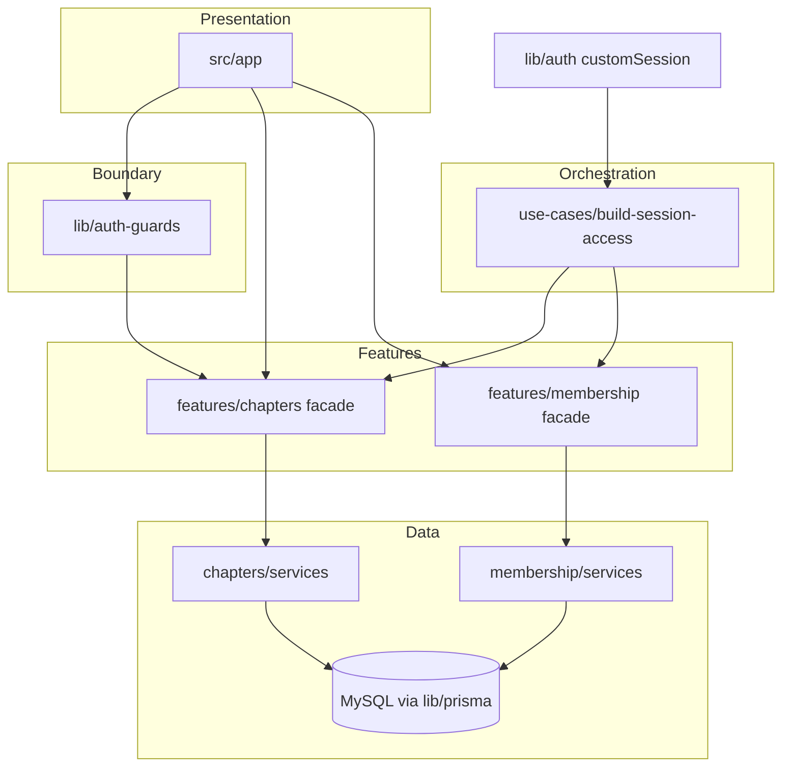

# Dependency graph

Which Use Cases call which Facades. Update this whenever a feature or use case is added.

| Use case | Facades it coordinates | Why it exists |
| --- | --- | --- |
| `build-session-access` | `chapters`, `membership` | The session payload needs the user's country-admin scopes (chapters) *and* their chapter memberships (membership). Two facades → a use case. |

Single-facade work has no use case: `lib/auth-guards` calls `chapters.getChapterCountryId`
directly, and future Server Actions call one facade directly.
