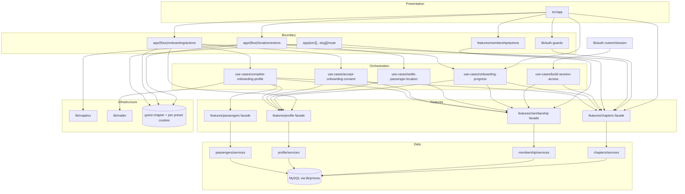

# Dependency graph

Which Use Cases call which Facades. Update this whenever a feature or use case is added.

| Use case | Facades it coordinates | Why it exists |
| --- | --- | --- |
| `build-session-access` | `chapters`, `membership` | The session payload needs the user's country-admin scopes (chapters) *and* their chapter memberships (membership). Two facades → a use case. |
| `onboarding-progress` | `chapters`, `membership`, `profile` | How far someone got is spread across three tables: which chapter they joined, what they consented to, whether a rider profile exists. Read by the `/onboarding` resolver and by every step that draws the progress dots. |
| `settle-passenger-location` | `membership`, `profile` | "Where do you live" and "which chapter serves you" are one answer given on one screen, but two features own the two halves. |
| `accept-onboarding-consent` | `membership`, `profile` | Records consent and, when a QR preset skipped the location step, performs the join it would have done. |
| `complete-onboarding-profile` | `chapters`, `membership`, `passengers`, `profile` | Writes the account's own details, creates the rider profile a ride will point at, resolves the chapter, and sends the welcome mail. |

Single-facade work has no use case: `lib/auth-guards` calls `chapters.getChapterCountryId`
directly, `features/membership/actions` calls the membership facade directly, and the passkey
and pilot-next-steps actions call the profile facade directly.

`lib/mapbox` and `lib/mailer` are cross-cutting infrastructure, callable from any layer — the
same standing as `lib/prisma` and `lib/sms`. `lib/mapbox` is reached only from a Server Action
so the secret token never enters a client bundle.
