# Dependency graph

Which Use Cases call which Facades. Update this whenever a feature or use case is added.

```mermaid
graph TD
  subgraph Presentation
    A[src/app]
    ADM[app/admin shell]
    CMD[app/admin/commands]
  end
  subgraph Boundary
    G[lib/auth-guards]
    ACT1[features/membership/actions]
    ACT2["app/(flow)/location/actions"]
    ACT3["app/(flow)/onboarding/actions"]
    ACT4["app/join/[[...slug]]/route"]
    ACT5[app/admin/members/actions]
    ACT6[app/admin/chapters/actions]
    ACT7[app/admin/countries/actions]
  end
  subgraph Orchestration
    U1[use-cases/build-session-access]
    U2[use-cases/onboarding-progress]
    U3[use-cases/settle-passenger-location]
    U4[use-cases/accept-onboarding-consent]
    U5[use-cases/complete-onboarding-profile]
    U6[use-cases/decide-pilot-application]
    U7[use-cases/change-member-role]
    U8[use-cases/submit-pilot-applications]
    U9[use-cases/manage-country-admins]
  end
  subgraph Features
    F1[features/chapters facade]
    F2[features/membership facade]
    F3[features/profile facade]
    F4[features/passengers facade]
    F5[features/activity facade]
    CM1[features/chapters/commands]
    CM2[features/membership/commands]
    CM3[features/profile/commands]
    CM4[features/passengers/commands]
  end
  subgraph Data
    S1[chapters/services]
    S2[membership/services]
    S3[profile/services]
    S4[passengers/services]
    S5[activity/services]
    DB[(MySQL via lib/prisma)]
  end
  subgraph Infrastructure
    MB[lib/mapbox]
    ML[lib/mailer]
    COOKIE[(guest chapter + join preset cookies)]
  end

  A --> G
  A --> F1
  A --> F5
  A --> U2
  G --> F1
  G --> F3
  AUTH[lib/auth customSession] --> U1

  A --> ADM
  ADM --> G
  ADM --> CMD
  CMD --> CM1
  CMD --> CM2
  CMD --> CM3
  CMD --> CM4

  A --> ACT1
  A --> ACT2
  A --> ACT3
  ACT1 --> F2
  ACT2 --> F1
  ACT2 --> U3
  ACT2 --> MB
  ACT2 --> COOKIE
  ACT3 --> F3
  ACT3 --> U2
  ACT3 --> U4
  ACT3 --> U5
  ACT3 --> COOKIE
  ACT4 --> F1
  ACT4 --> COOKIE

  ADM --> ACT5
  ADM --> ACT6
  ADM --> ACT7
  ACT1 --> U8
  ACT5 --> F2
  ACT5 --> U6
  ACT5 --> U7
  ACT6 --> F1
  ACT7 --> F1
  ACT7 --> U9

  U1 --> F1
  U1 --> F2
  U2 --> F1
  U2 --> F2
  U2 --> F3
  U3 --> F2
  U3 --> F3
  U4 --> F2
  U4 --> F3
  U5 --> F1
  U5 --> F2
  U5 --> F3
  U5 --> F4
  U5 --> ML
  U6 --> F1
  U6 --> F2
  U6 --> F3
  U6 --> F5
  U6 --> ML
  U7 --> F2
  U7 --> F3
  U7 --> F5
  U8 --> F2
  U8 --> F5
  U9 --> F1
  U9 --> F3
  U9 --> F5

  F1 --> S1
  F2 --> S2
  F3 --> S3
  F4 --> S4
  F5 --> S5
  S1 --> DB
  S2 --> DB
  S3 --> DB
  S4 --> DB
  S5 --> DB
```

| Use case | Facades it coordinates | Why it exists |
| --- | --- | --- |
| `build-session-access` | `chapters`, `membership` | The session payload needs the user's country-admin scopes (chapters) *and* their chapter memberships (membership). Two facades → a use case. |
| `onboarding-progress` | `chapters`, `membership`, `profile` | How far someone got is spread across three tables: which chapter they joined, what they consented to, whether a rider profile exists. Read by the `/onboarding` resolver and by every step that draws the progress dots. |
| `settle-passenger-location` | `membership`, `profile` | "Where do you live" and "which chapter serves you" are one answer given on one screen, but two features own the two halves. |
| `accept-onboarding-consent` | `membership`, `profile` | Records consent and, when a QR preset skipped the location step, performs the join it would have done. |
| `complete-onboarding-profile` | `chapters`, `membership`, `passengers`, `profile` | Writes the account's own details, creates the rider profile a ride will point at, resolves the chapter, and sends the welcome mail. |
| `decide-pilot-application` | `activity`, `chapters`, `membership`, `profile` | One approval writes the decision, the granted role, the history events and the applicant's email — in the applicant's own locale, so the profile is read too. |
| `change-member-role` | `activity`, `membership`, `profile` | A promote/demote/remove is a membership write plus a history event; appointing by email resolves the address through `profile` first. |
| `submit-pilot-applications` | `activity`, `membership` | The application rows are upserted, so the "asked to pilot" line has to live in `activity` to survive a re-application. |
| `manage-country-admins` | `activity`, `chapters`, `profile` | Country-admin rows belong to `chapters`, the email lookup to `profile`, and the audit line to `activity`. |

No use case was added for the admin shell. `G --> F1` now carries two guards:
`requireChapterAdmin` (`chapters.getChapterCountryId`) and `requireAdminScope`
(`chapters.listCountries` + `chapters.listChapters`). Resolving the admin scope needs the
`chapters` facade and nothing else, so per AGENTS.md it collapsed into `lib/auth-guards`
rather than becoming a use case — the same call the `requireChapterAdmin` precedent already
makes. If it ever needs a second facade (say, membership counts per chapter), that is when it
graduates to `src/use-cases/`.

The `CM*` nodes are the ⌘K contributions, not a new layer: `app/admin/commands` imports each
slice's `commands.ts` and merges it into the palette. They sit in the Features subgraph
because they are part of the slice's public surface — `eslint.config.mjs` lists
`src/features/*/{facade,index,commands}.ts` as the `feature-facade` element — and they import
nothing but types, so no edge leaves them.

Single-facade work has no use case: `lib/auth-guards` calls `chapters.getChapterCountryId`
and `profile.getProfile` (the admin passkey gate) directly, `app/admin/chapters/actions` calls
the chapters facade directly, `features/membership/actions` calls the membership facade
directly, and the passkey and pilot-next-steps actions call the profile facade directly.

`features/activity` (F5) is a slice with no UI of its own: every write goes through a use
case that pairs it with the mutation it records, and the only read is the person-history feed
on `/admin/members/[userId]`, which calls the facade straight from the Server Component.

`lib/mapbox` and `lib/mailer` are cross-cutting infrastructure, callable from any layer — the
same standing as `lib/prisma` and `lib/sms`. `lib/mapbox` is reached only from a Server Action
so the secret token never enters a client bundle.
