# Dependency graph

Which Use Cases call which Facades. Update this whenever a feature or use case is added.

The audit log is **infrastructure**, not a feature: it lives in `src/lib/activity` beside
`lib/auth-guards` and `lib/mailer`, so any layer may write a history line. That is why
`change-member-role`, `submit-pilot-applications` and `claim-account` are gone — each
coordinated exactly one feature plus the log, which AGENTS.md says is not a use case. Their
logic sits in the facade that owns the domain rule (`membership.changeMemberRole` carries the
"cannot change your own role" rule; `accounts.claimAccount` the claim), and the Action calls
that facade directly.

`decide-pilot-application` is gone for the same reason. Once the decision emitted
`pilotApplication.decided` instead of calling the activity log and the mailer itself, it
coordinated one facade and nothing else, so it collapsed into `membership.decideApplication`
— which now owns the transaction the `Event` row commits in — and `app/admin/members/actions`
calls that facade directly. Its old work is two listeners in the worker.

> Newly qualifying for the same treatment: `manage-chapter` and `manage-country` now touch
> only `chapters` plus the log, so both could collapse into their Actions or into the
> `chapters` facade. Left as-is deliberately — the facade already exports thin
> `createChapter`/`updateChapter`/`deleteChapter` wrappers, so merging them is a naming
> decision rather than a mechanical move.

```mermaid
graph TD
  subgraph Presentation
    A[src/app]
    ADM[app/admin shell]
    CMD[app/admin/commands]
    MEM["app/(member) shell"]
    ACCT[components/account surface]
    BELL[components/notifications bell]
    PR[components/push-registrar]
    CHATUI[features/chat/components]
  end
  subgraph Boundary
    G[lib/auth-guards]
    ACT1[features/membership/actions]
    ACT2["app/(flow)/location/actions"]
    ACT3["app/(flow)/onboarding/actions"]
    ACT4["app/join/[slug]/start/route"]
    ACT5[app/admin/members/actions]
    ACT6[app/admin/chapters/actions]
    ACT7[app/admin/countries/actions]
    ACT8[features/accounts/actions]
    ACT9[features/notifications/actions]
    ACT10[app/admin/settings/actions]
    ACT11[features/profile/actions]
    ACT12[features/chat/actions]
    RT1[app/api/chat/stream route]
    RT2["app/chat/[id] deep-link route"]
    RT3["app/api/calendar/[file] feed route"]
    ACT13[features/calendar-feeds/actions]
    ACT14[features/fleet/actions]
    ACT15[app/admin/rides/actions]
    RT4["app/api/files/[id] route"]
    ACT0[app/actions setLocale]
  end
  subgraph Orchestration
    U1[use-cases/build-session-access]
    U2[use-cases/onboarding-progress]
    U3[use-cases/settle-passenger-location]
    U4[use-cases/accept-onboarding-consent]
    U5[use-cases/complete-onboarding-profile]
    U9[use-cases/manage-country-admins]
    U10[use-cases/provision-assisted-passenger]
    U11[use-cases/invite-chapter-user]
    U13[use-cases/manage-chapter]
    U14[use-cases/manage-country]
    U15[use-cases/notifications/notify]
    U16[use-cases/notifications/deliver-email]
    U17[use-cases/notifications/deliver-push]
    U18[use-cases/notifications/inbox]
    U19[use-cases/notifications/kinds]
    U20[use-cases/member-home]
    U21[use-cases/update-own-details]
    U22[use-cases/chat/chat-inbox]
    U23[use-cases/chat/conversation-view]
    U24[use-cases/chat/start-direct-chat]
    U25[use-cases/chat/create-group-chat]
    U26[use-cases/chat/oversight]
    U27[use-cases/chat-notifications/notify-chat-message]
    U28[use-cases/chat-notifications/deliver-chat-push]
    U29[use-cases/chat-notifications/deliver-chat-digest]
    U30[use-cases/calendar-feed]
    U31[use-cases/schedule-ride]
    U32[use-cases/report-damage]
    U33[use-cases/leave-pool]
    U34[use-cases/trishaw-history]
    U35[use-cases/finish-ride]
  end
  subgraph Worker
    W1["worker/index (dispatcher, sweeper, prune-devices, prune-chat, email + push workers)"]
    W2[worker/handlers registry]
    W3["worker/listeners/record-activity (generic)"]
    W4[worker/deliveries]
  end
  subgraph Features
    F1[features/chapters facade]
    F2[features/membership facade]
    F3[features/profile facade]
    F4[features/passengers facade]
    F6[features/accounts facade]
    F7[features/notifications facade]
    F8[features/chat facade]
    F9[features/rides facade]
    F10[features/calendar-feeds facade]
    F11[features/fleet facade]
    CM6[features/fleet/commands]
    CM1[features/chapters/commands]
    CM2[features/membership/commands]
    CM3[features/profile/commands]
    CM4[features/passengers/commands]
    CM5[features/chat/commands]
  end
  subgraph Data
    S1[chapters/services]
    S2[membership/services]
    S3[profile/services]
    S4[passengers/services]
    S6[accounts/services]
    S7[notifications/services]
    S8[chat/services]
    S9[rides/services]
    S10[calendar-feeds/services]
    S11[fleet/services]
    DB[(MySQL via lib/prisma)]
  end
  subgraph Infrastructure
    F5[lib/activity]
    OBS["lib/observability (logger, metrics, Sentry, context)"]
    EV[lib/events outbox]
    Q[("Redis via BullMQ")]
    MB[lib/mapbox]
    CAL[lib/calendar + lib/time-zone]
    ML[lib/mailer]
    PUSH[lib/push firebase-admin]
    NP[lib/native/push]
    RTH[lib/realtime hub + presence]
    CRY[lib/crypto/chat-cipher]
    FSIG[lib/crypto/feed-signature]
    ICS[lib/ics]
    BA[lib/auth BetterAuth admin API]
    COOKIE[(guest chapter + join preset cookies)]
    STO["lib/storage (S3 presign, sharp)"]
    NC[lib/native/camera]
  end

  A --> G
  A --> F1
  A --> F5
  A --> F9
  A --> CAL
  ADM --> F9
  ADM --> CAL
  A --> U2
  G --> F1
  G --> F3
  AUTH[lib/auth customSession] --> U1

  A --> MEM
  MEM --> G
  MEM --> U20
  MEM --> ACCT
  MEM --> BELL
  ADM --> ACCT
  ACCT --> ACT11
  ACCT --> ACT8
  ACCT --> ACT0
  ACT11 --> G
  ACT11 --> F3
  ACT11 --> U21
  ACT0 --> G
  ACT0 --> F3
  U20 --> F1
  U20 --> F2
  U21 --> F3
  U21 --> F4

  A --> BELL
  ADM --> BELL
  BELL --> G
  BELL --> U18
  BELL --> ACT9
  A --> PR
  PR --> ACT9
  PR --> NP
  ACT9 --> G
  ACT9 --> F7
  ADM --> ACT10
  ACT10 --> G
  ACT10 --> F1

  A --> ADM
  ADM --> G
  ADM --> CMD
  CMD --> CM1
  CMD --> CM2
  CMD --> CM3
  CMD --> CM4
  CMD --> CM5

  MEM --> CHATUI
  ADM --> CHATUI
  MEM --> U22
  MEM --> U23
  ADM --> U22
  ADM --> U23
  MEM --> F8
  ADM --> F8
  CHATUI --> ACT12
  ACT12 --> G
  ACT12 --> F8
  ACT12 --> U22
  ACT12 --> U24
  ACT12 --> U25
  RT1 --> F8
  RT1 --> RTH
  RT2 --> G
  U22 --> F8
  U22 --> F3
  U22 --> RTH
  U23 --> F8
  U23 --> F3
  U23 --> RTH
  U24 --> F8
  U24 --> F1
  U24 --> F2
  U24 --> F3
  U25 --> F8
  U25 --> F1
  U25 --> F2
  U26 --> F8
  U26 --> F3
  U27 --> F8
  U27 --> F3
  U27 --> F7
  U27 --> RTH
  U27 --> Q
  U28 --> F8
  U28 --> F3
  U28 --> F7
  U28 --> PUSH
  U29 --> F8
  U29 --> F3
  U29 --> F7
  U29 --> ML
  F8 --> S8
  F8 --> CRY
  F8 --> RTH
  F8 --> EV
  S8 --> DB
  W1 --> F8
  W1 --> U28
  W1 --> U29
  W2 --> U27

  A --> ACT1
  A --> ACT2
  A --> ACT3
  ACT1 --> F2
  ACT3 --> F6
  ACT2 --> F1
  ACT2 --> U3
  ACT2 --> MB
  ACT2 --> COOKIE
  ACT3 --> F3
  ACT3 --> U2
  ACT3 --> U4
  ACT3 --> U5
  ACT3 --> COOKIE
  ACT4 --> F1
  ACT4 --> COOKIE

  ADM --> ACT5
  ADM --> ACT6
  ADM --> ACT7
  ADM --> ACT8
  ACT8 --> U10
  ACT8 --> U11
  ACT8 --> F6
  ACT5 --> F2
  ACT5 --> F6
  ACT6 --> F1
  ACT6 --> U13
  ACT6 --> MB
  ACT7 --> F1
  ACT7 --> U9
  ACT7 --> U14

  U1 --> F1
  U1 --> F2
  U2 --> F1
  U2 --> F2
  U2 --> F3
  U3 --> F2
  U3 --> F3
  U4 --> F2
  U4 --> F3
  U5 --> F2
  U5 --> F3
  U5 --> F4
  U9 --> F1
  U9 --> F3
  U10 --> F2
  U10 --> F4
  U10 --> F5
  U10 --> F6
  U11 --> F2
  U11 --> F3
  U11 --> F6
  U13 --> F1
  U13 --> F5
  U14 --> F1
  U14 --> F5
  U15 --> F7
  U15 --> U19
  U15 --> Q
  U16 --> F7
  U16 --> F1
  U16 --> F3
  U16 --> F5
  U16 --> ML
  U16 --> U19
  U17 --> F7
  U17 --> F3
  U17 --> PUSH
  U17 --> U19
  U18 --> F7
  U18 --> U19
  U19 --> F1
  U19 --> F2
  U19 --> F3

  F1 --> EV
  F2 --> EV
  F3 --> EV
  EV --> DB
  EV --> Q
  Q --> W1
  W1 --> EV
  W1 --> F7
  W1 --> W2
  W1 --> W4
  W4 --> U16
  W4 --> U17
  W2 --> U15
  W2 --> W3
  W3 --> F5

  F1 --> S1
  F9 --> S9
  S9 --> DB

  ACCT --> F10
  ACCT --> ACT13
  ACT13 --> G
  ACT13 --> F10
  RT3 --> U30
  RT3 --> F10
  U30 --> F10
  U30 --> F2
  U30 --> F4
  U30 --> F9
  U30 --> ICS
  F10 --> S10
  F10 --> FSIG
  S10 --> DB
  CMD --> CM6
  ADM --> F11
  MEM --> F11
  ADM --> ACT14
  MEM --> ACT14
  ADM --> ACT15
  MEM --> NC
  ACT14 --> G
  ACT14 --> F11
  ACT14 --> F1
  ACT14 --> F9
  ACT14 --> U32
  ACT14 --> U33
  ACT15 --> G
  ACT15 --> F9
  ACT15 --> U31
  RT4 --> G
  RT4 --> F11
  RT4 --> STO
  ADM --> U31
  ADM --> U34
  MEM --> U35
  U13 --> F11
  U31 --> F11
  U31 --> F9
  U32 --> F11
  U32 --> F9
  U33 --> F11
  U33 --> F9
  U34 --> F11
  U34 --> F9
  U35 --> F1
  U35 --> F9
  U35 --> F11
  U19 --> F11
  F11 --> S11
  F11 --> EV
  F11 --> STO
  S11 --> DB
  F2 --> S2
  F2 --> F5
  F6 --> F5
  F1 --> F5
  F3 --> S3
  F4 --> S4
  F6 --> S6
  F7 --> S7
  S7 --> DB
  S1 --> DB
  S2 --> DB
  S3 --> DB
  S4 --> DB
  F5 --> DB
  S6 --> DB
  S6 --> BA
```

| Use case | Facades it coordinates | Why it exists |
| --- | --- | --- |
| `build-session-access` | `chapters`, `membership` | The session payload needs the user's country-admin scopes (chapters) *and* their chapter memberships (membership). Two facades → a use case. |
| `onboarding-progress` | `chapters`, `membership`, `profile` | How far someone got is spread across three tables: which chapter they joined, what they consented to, whether a rider profile exists. Read by the `/onboarding` resolver and by every step that draws the progress dots. |
| `settle-passenger-location` | `membership`, `profile` | "Where do you live" and "which chapter serves you" are one answer given on one screen, but two features own the two halves. |
| `accept-onboarding-consent` | `membership`, `profile` | Records consent and, when a QR preset skipped the location step, performs the join it would have done. |
| `complete-onboarding-profile` | `membership`, `passengers`, `profile` | Writes the account's own details, creates the rider profile a ride will point at, and stamps `onboardedAt`. The welcome mail is no longer sent here: `profile.completeOnboarding` emits `user.onboarded` and the pipeline does the rest, exactly once. |
| `notifications/notify` | `notifications` (+ the kinds) | The generic listener. A kind names the recipients and the parameters; this writes one inbox row each and queues push and email per the kind's policy. Runs in the worker, from an event, with no session. |
| `notifications/deliver-email` | `notifications`, `profile`, `chapters` (+ `activity`, `mailer`) | One email for one `Notification`, in the recipient's own locale (hence `profile`), with the attempt recorded on the `Delivery` row. A delayed `ifNoPush` job re-checks here whether the push landed or the row was already read. `chapters.getSettings` supplies the chapter's reply-to, so an answer goes back to the chapter the mail was about. |
| `notifications/deliver-push` | `notifications`, `profile` (+ `lib/push`) | One push for one `Notification`: the recipient's opt-in and device tokens, the locale for the copy, `sendPush` through `firebase-admin`, and dead tokens pruned from the `device` table. A kind may also carry a `chapterAllowsPush` hook, which the kinds (U19) answer from `chapters`. Missing credentials are a `skipped` row, not a retry. |
| `notifications/inbox` | `notifications` (+ the kinds) | The bell's read model: stored payloads rendered back into `{ title, body, href }` in the reader's locale, plus the unseen count. Its kind lookup is non-throwing, so a retired kind leaves a gap in the list instead of blanking the bell. |
| `member-home` | `chapters`, `membership` | Where a member belongs: their memberships, their open applications and the chapter rows behind both. `cache()`d, because the sidebar subtitle and the home's chapter cards ask it in the same request from two different Suspense boundaries. |
| `update-own-details` | `passengers`, `profile` | `birthDate` and `gender` are deliberately duplicated onto the rider row an account books its own rides with, so one edit in the account surface has to reach both. A name-only edit stops at `profile` — splitting one string back into `firstName`/`lastName` would be lossy. |
| `manage-country-admins` | `chapters`, `profile` | Appointing by email needs the lookup in `profile` and the row in `chapters`. Removal coordinates nothing, so it collapsed into `app/admin/countries/actions`, and the history line now comes from the `countryAdmin.*` events. |
| `provision-assisted-passenger` | `accounts`, `membership`, `passengers`, `activity` | One "add a passenger at the door" makes the account, joins the chapter, creates the rider row and records who created it — four features, and the helper rule decides whether the rider row points at the new account or at nobody. |
| `invite-chapter-user` | `accounts`, `membership`, `profile` | Provisioning the account, seeding the invitee's language from the inviter's, and granting the chapter roles are three features. It sends nothing: `membership.inviteMember` emits `member.invited` and the pipeline mails it. |
| `manage-chapter` | `chapters`, `activity` | Creating, editing or deleting a chapter is a `chapters` write plus the history line that makes it legible on the chapter's own page. `chapters.diffChapter` turns one autosave into one `chapterUpdated` event per field that actually changed (a moved pin and its new address fold into one `location` change), and the delete event is recorded *global* because the row it would point at is gone. |
| `manage-country` | `chapters`, `activity` | Deleting a country takes every chapter under it (the relation restricts, so the service deletes both in one transaction) and writes the history: one `countryDeleted` line plus a `chapterDeleted` line per chapter, all recorded *global* because the rows they would point at are gone. |
| `chat/chat-inbox` | `chat`, `profile` (+ `lib/realtime` presence) | A conversation row is a chat row, a name and a face from `profile`, and a green dot from Redis. `getInbox` and `syncInbox` share one batched `profile.getProfiles` and one pipelined `isOnline`, so an inbox of fifty costs three queries. |
| `chat/conversation-view` | `chat`, `profile` (+ `lib/realtime` presence) | The same join for one open thread: the summary, its members with names, avatars and presence (capped at 200 — `memberCount` carries the truth), and the first page of messages. It reuses `chat-inbox`'s `displayOf`, so the list row and the thread header never name a conversation differently. |
| `chat/start-direct-chat` | `chat`, `profile`, `membership`, `chapters` | Reach is the rule that needs four features: find the person by exact email or E.164 (`profile`), then allow it only when both share a chapter (`membership`), or the viewer is a superadmin, a chapter admin over one of the target's chapters, or the country admin above one (`chapters`). The first shared chapter is what the conversation stores as its `chapterId`, which is what oversight later reads. |
| `chat/create-group-chat` | `chat`, `membership`, `chapters` | Every initial member must belong to the group's chapter, and so must the creator unless they administer it. One roster read answers both questions. |
| `chat/oversight` | `chat`, `profile` | Maps an `AdminScope` plus the active scope to chapter ids and names the participants of a direct conversation. It authorises nothing itself — the page runs `requireAdminScope` and re-guards on the conversation's own `chapterId`. |
| `chat-notifications/notify-chat-message` | `chat`, `profile`, `notifications` (+ `lib/realtime` presence, BullMQ) | The `chat.messageSent` listener. Drops the sender, then per recipient in chunks of 25: mute, `presence.isFocusedOn`, preference, device tokens — a `chat` push job for anyone reachable, a debounced `chat-digest` mail job for anyone not. Writes no `Notification` row: chat never appears in the bell. |
| `chat-notifications/deliver-chat-push` | `chat`, `profile`, `notifications` (+ `lib/push`) | One banner for one message, re-deciding at wake-up: still unread, still unmuted, still opted in. Titled "Anna Berg" or "Anna Berg · Saturday crew", body stripped of markdown to 140 characters, collapsed per conversation so ten messages are one banner. |
| `calendar-feed` | `calendar-feeds`, `membership`, `passengers`, `rides` (+ `lib/ics`) | One poll of a subscribed calendar: `calendar-feeds` turns the address into an owner (signature first, then the row, then the ban check), `membership` says where that owner may read rides as a pilot (`/pilot`'s rule: the pilot role somewhere, current membership of the ride's chapter), `passengers` names the riders they manage, and `rides` returns the union with nobody's name in it. The strings come from the owner's stored locale, because a poll carries no session. Called only from the feed route (RT3). |
| `schedule-ride` | `fleet`, `rides` | Whether a chapter may use a trishaw (its location, a pool it was approved for, the status) is the fleet's rule; the reservation under a row lock is the calendar's. `allocateTrishaws` checks only the trishaws being *added*, so one grounded after allocation stays on the ride with a warning instead of blocking every other edit. `allocationChoices` reads overlapping rides across every chapter that shares a pool, because a pooled bike booked by the neighbour is still booked. |
| `report-damage` | `fleet`, `rides` | A pilot may report only on a ride they were assigned to and a trishaw that was on it (`rides`); the damage, the grounding and the `trishaw.damageReported` event are `fleet`'s. The upcoming rides a grounding endangers come from `rides` and travel in the event. |
| `leave-pool` | `fleet`, `rides` | Leaving is blocked while the chapter still has future rides with the pool's trishaws — that count is the calendar's. |
| `trishaw-history` | `fleet`, `rides` | One timeline from rides (with pilots), damages and the trishaw log. |
| `finish-ride` | `chapters`, `fleet`, `rides` | The pilot's post-ride page: the chapter's post-ride instructions, and per trishaw its location's return instructions and access code — only for the ride's own pilots. |
| `chat-notifications/deliver-chat-digest` | `chat`, `profile`, `notifications` (+ `lib/mailer`) | One grouped mail for everything unread in one conversation, for a recipient push cannot reach. Re-checks membership, unread, mute, preference and *still no push* before decrypting a single row. |

The chat use cases exist for the reason the manifesto gives: a facade may not call another
feature, and none of these is about chat alone. Naming a conversation needs `profile`. Deciding
who may start one needs `membership` and `chapters`. Drawing a row needs presence from
`lib/realtime` on top of both. Everything that *is* about chat alone — send, edit, delete,
react, mark read, mute, leave, freeze, continue — stays a single facade call behind
`features/chat/actions`, with no use case in between.

`lib/realtime` (RTH) and `lib/crypto/chat-cipher` (CRY) are cross-cutting infrastructure, the
same standing as `lib/push` and `lib/mailer`: the facade publishes through the hub, the SSE
route subscribes through it, the notification listener asks it who is focused, and the worker
would too. `CRY` has exactly one caller — the chat facade — because services stay dumb and hand
`Bytes` in and out, and no other layer ever sees plaintext it did not decrypt itself.

`RT1` and `RT2` are Route Handlers sitting in the Boundary subgraph on purpose. A Route Handler
is the boundary when the transport cannot be a Server Action: `GET /api/chat/stream` is an SSE
connection and `/chat/[id]` is a deep link from a push banner or a digest mail. Both guard
themselves and then call facades, exactly as an `actions.ts` does — `proxy.ts` excludes
`/api/`, so the stream is its own gate.

`RT3` is the third Route Handler in the Boundary subgraph, for the same reason as the other
two: a calendar server can only issue a `GET` with the credential in the URL. It checks the file
name's shape, asks `calendarFeeds.feedKeyOf` (F10) for the signature's verdict *before* the
per-address rate limit so a forged address never allocates a limiter bucket, delegates to `U30`, and owns only HTTP — the ETag,
the 304, the private headers. Enabling, resetting and turning off the address (ACT13) touch
`calendar-feeds` alone, so they are Actions behind `requireAuth` with no use case, and the
account surface (ACCT) reads `calendarFeeds.getFeed` directly in `loadAccount`, the same way it
reads `profile`. `FSIG` has one caller, the `calendar-feeds` facade, which is the same standing
`CRY` has with chat; `ICS` is pure serialisation like `CAL`.

No use case was added for `rides` either. The calendar surfaces — `/admin/rides`,
`/admin/bikes`, `/pilot` and `/passenger` — are Server Components that read the `rides`
facade directly. `/admin/rides` and `/admin/bikes` additionally read
`chapters.getChapterTimeZones`, because a calendar has to know which clock to draw in; a
Server Component reading two facades is the existing pattern (`/admin/passengers` already
reads `passengers` and `chapters`), and the Use Case rule in AGENTS.md governs Actions, not
pages. The slice contributes no `commands.ts`: both of its destinations already have `NAV`
rows, so the shell claims them by href, and it has no verbs of its own until ride scheduling
(COD-155/179) lands.

`lib/calendar` and `lib/time-zone` (CAL) are cross-cutting infrastructure beside
`lib/format`: pure functions over instants and IANA zones, no React and no Prisma, so a
facade, a page or a test may use them.

No use case was added for the admin shell. `G --> F1` now carries two guards:
`requireChapterAdmin` (`chapters.getChapterCountryId`) and `requireAdminScope`
(`chapters.listCountries` + `chapters.listChapters`). Resolving the admin scope needs the
`chapters` facade and nothing else, so per AGENTS.md it collapsed into `lib/auth-guards`
rather than becoming a use case — the same call the `requireChapterAdmin` precedent already
makes. If it ever needs a second facade (say, membership counts per chapter), that is when it
graduates to `src/use-cases/`.

The `CM*` nodes are the ⌘K contributions, not a new layer: `app/admin/commands` imports each
slice's `commands.ts` and merges it into the palette. They sit in the Features subgraph
because they are part of the slice's public surface — `eslint.config.mjs` lists
`src/features/*/{facade,index,commands}.ts` as the `feature-facade` element — and they import
nothing but types, so no edge leaves them.

Single-facade work has no use case: `lib/auth-guards` calls `chapters.getChapterCountryId`
and `profile.getProfile` (the admin passkey gate) directly, `app/admin/chapters/actions` calls
the chapters facade directly, `features/membership/actions` calls the membership facade
directly, and the passkey and pilot-next-steps actions call the profile facade directly.
`deleteOwnAccountAction` (in ACT8) is the same: `accounts.deleteUser` is one facade call
behind `requireAuth` plus `canDeleteOwnAccount`, and the schema cascades the rest, so it is an
Action and not a use case — the mirror of `ACT5 --> F6` below, with the session as the only
subject. `features/notifications/actions` (ACT9) is the same shape: mark seen, mark read, register and
unregister a device are four writes into one facade, called from the bell (BELL) and from the
push registrar (PR). `app/admin/settings/actions` (ACT10) likewise: one write of the chapter's
`ChapterSettings` row behind `requireChapterAdmin`, so it calls `chapters.updateSettings`
directly.

`W1 --> F7` is the one edge from the worker straight into a facade: the nightly
`prune-devices` scheduler calls `notifications.pruneStaleDevices()`. Token hygiene
coordinates one feature and carries no session, so per AGENTS.md it is not a use case —
`worker/index` dispatches it next to `sweep` through its `MAINTENANCE` map. See
[EVENTS.md](../EVENTS.md) → *Maintenance jobs*.

`MEM` is the member shell (`src/app/(member)`) and `ACCT` the account surface
(`src/components/account`). Neither is a feature slice: the shell is routing plus chrome and
the surface is cross-route UI over `lib`, which is why they sit in Presentation and reach the
server only through `G` (`perspectiveViewerSession`, `requirePerspective`), one use case
(`U20`) and Server Actions. `ADM --> ACCT` is the same surface mounted from the admin
sidebar's user menu — one implementation, three call sites.

The bell reads through a use case (U18) because rendering a stored payload needs the kinds,
not because two features are involved.

`features/accounts` (F6) has no UI of its own either — its Server Actions (ACT8) are imported
straight into the admin passengers and members screens, because "provision a user" is not a
page. `app/admin/members/actions` also calls `accounts.deleteUser` directly (`ACT5 --> F6`):
the hard delete touches one feature — the schema cascades everything else — so it is an
Action behind `requireSuperAdmin`, not a use case. `S6` is the only place outside `prisma/seed.ts` that calls BetterAuth's admin API
(`auth.api.createUser`); everything else in that slice is ordinary Prisma.
`accounts.claimAccount` is called from the onboarding consent action (ACT3), not from the
admin shell: the account is claimed by the person who received it, at the one step nobody may
take on their behalf.

`lib/activity` (F5) is cross-cutting infrastructure, the same standing as `lib/auth-guards`
and `lib/mailer`: a facade, a use case or a Server Component may write a history line, and it
owns no domain of its own. Writes sit next to the mutation they record; the only reads are the
person-history feed on `/admin/members/[userId]` and the chapter history on
`/admin/chapters/[chapterId]`, both straight from the Server Component.

`lib/observability` (OBS) is cross-cutting infrastructure of the same kind, one step wider:
every node in the graph may log a line or move a counter, which is why no edges are drawn to
it — they would reach every box and say nothing. `pino` and `prom-client` are importable
nowhere else (lint-enforced), so the whole system has one logger and one registry; Sentry is
used straight from the SDK over the shared options in `observability/sentry-shared.ts`.

What *is* constrained is **capture**. Only Boundary nodes (every `actions.ts` via
`actionFailure`, the route handlers via `onRequestError`), Orchestration nodes that own a
failure, and the Worker (its `failed` listener, on the last attempt) call `captureException`.
Facades (F\*) and services (S\*) throw and never report — a facade that imports capture turns
one failure into one issue per layer it crossed.

`lib/mapbox`, `lib/mailer` and `lib/push` are cross-cutting infrastructure, callable from any
layer — the same standing as `lib/prisma` and `lib/sms`. `lib/mapbox` is reached only from a
Server Action so the secret token never enters a client bundle — the location flow's actions
(ACT2) and the admin chapter actions (ACT6: suggest, retrieve and reverse-geocode behind
`requireAdminScope` and a per-user rate limit) are its two callers.

`lib/mailer` now has exactly two callers: `deliver-email` and the sign-in OTP inside
better-auth. Every other mail in the product is a notification kind, so no use case imports it
any more. `lib/push` has one, `deliver-push`, and one import site for `firebase-admin`
(lint-enforced) so service-account credentials cannot reach a browser bundle. Its client
counterpart `lib/native/push` is the only place `@capacitor-firebase/messaging` is imported.

### Fleet (trishaws, models, locations, pools, damages)

`features/fleet` (F11) owns `TrishawType`, `StorageLocation`, `StorageLocationChapter` (pool
membership), `Trishaw`, `TrishawDamage`, `TrishawLogEntry` and `StoredFile`. `rides` keeps
`RideTrishaw` and the reservation lock; it no longer knows who may use a trishaw. Everything
that needs both goes through U31–U35. `manage-chapter` (U13) now also creates the chapter's
default location, which is why it coordinates `fleet` as well.

Authority is data: the facade answers `locationAuthority`, `locationTrishawManagers`,
`trishawReaders`, `damageAuthority`, … as an `AdminAuthority` (chapters + countries), and the
Action passes it to `requireAdminOf` in `lib/auth-guards`, which evaluates it with
`allowsAdmin` from `lib/access`. The facade never sees a session.

`RT4` (`/api/files/[id]`) is the only way a stored file is served: `getSession`, then
`fleet.readableFile` decides per kind, then a 302 to a five-minute signed GET. `lib/storage`
(STO) is infrastructure like `lib/mailer`: presigned PUTs to the private bucket, then a commit
step that HEADs the staged object, re-encodes images to WebP with `sharp` (PDFs must start with
`%PDF-`) and writes the final key. Nothing a browser uploaded is served unprocessed.
`lib/native/camera` (NC) is the only importer of `@capacitor/camera`.

The notification kinds (U19) now reach `fleet` for trishaw and pool names:
`trishaw.damageReported`, `pool.accessRequested` and `pool.accessDecided`, category `fleet`.
